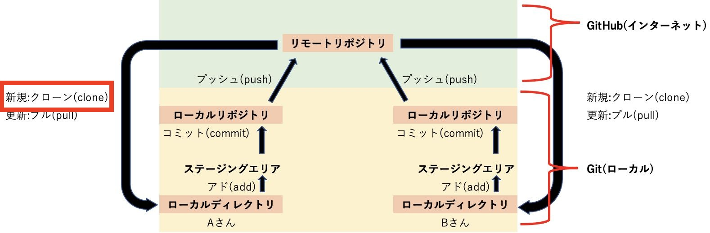
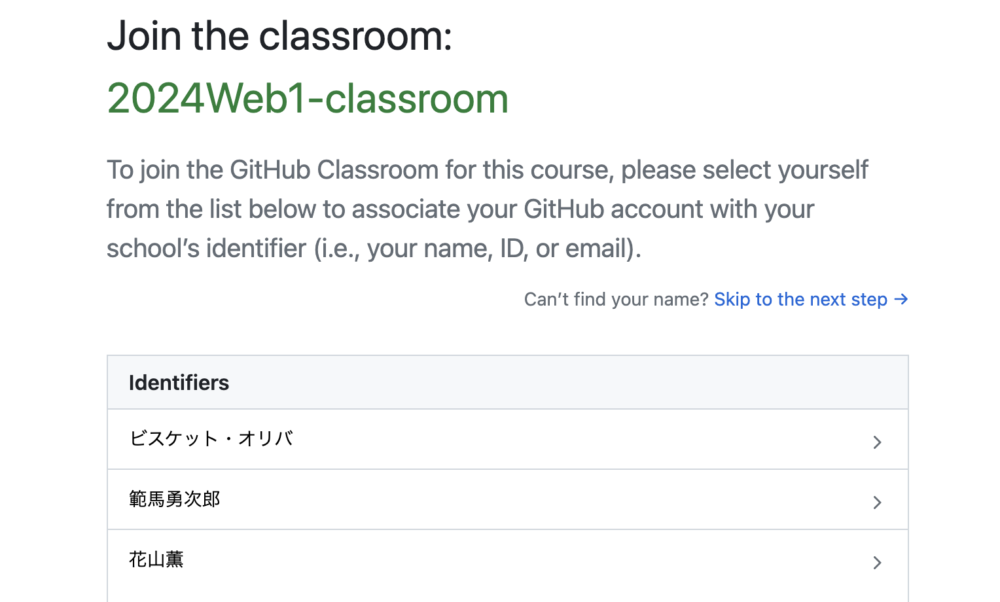
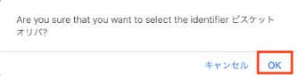
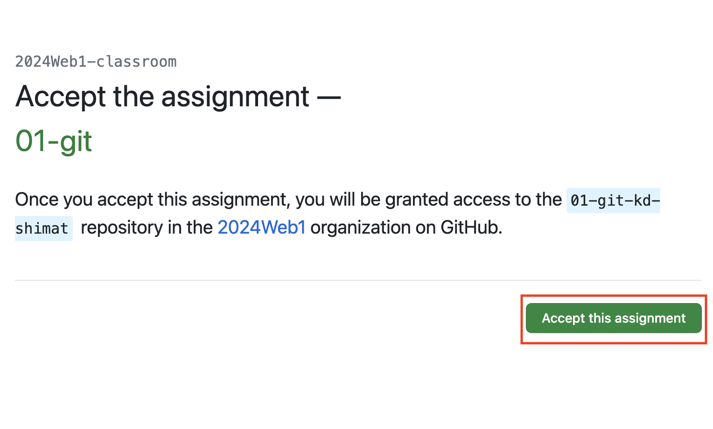
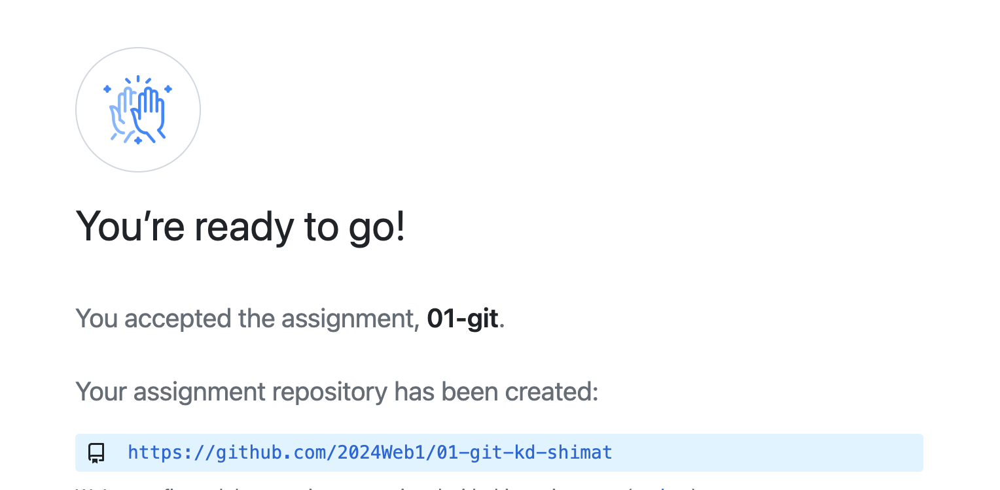
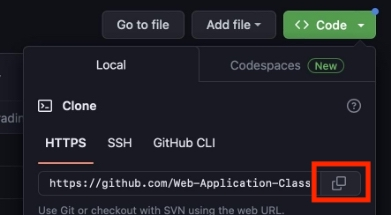
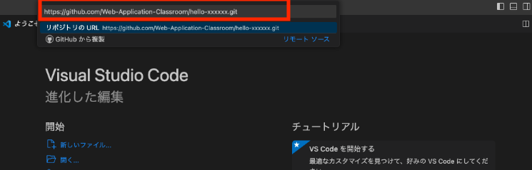
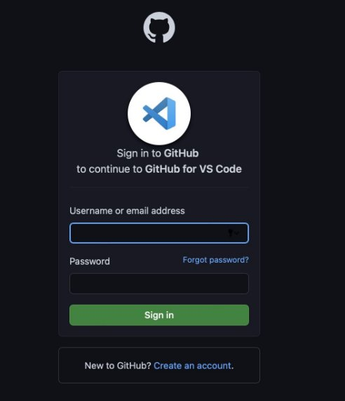

# GitHub Classroom①

本授業では、 **GitHub Classroom** を利用してコードの取得や課題提出をします。
GitHub Classroomは、GitHubを利用した課題管理ツールで、課題の提出や採点を効率的に行うことができるサービスです。

## GitHub Classroomからコードを取得(clone)

{: style="width: 660px;height: auto;" }

GitHub Classroomからコードを取得します。
今後も章が進むたびに、この手順を繰り返すので、慣れるようにしましょう。

1. 本授業のコード保管用フォルダ`¥web_app_dev`を、Cドライブ直下に作成
2. [こちらのリンク]()にアクセス<br>
   ※ログインを求められた場合は、GitHubアカウントでログインしてください。
3. 自分の名前を選んでクリック<br>
{: style="width: 660px;height: auto;" }<br><br>
{: style="width: 660px;height: auto;" }<br><br>
4. `Accept this assignment`をクリック<br>
{: style="width: 660px;height: auto;" }<br><br>
5. コード取得用のリンクをクリック
   ※リンクが表示されない場合は、ブラウザをリロードしてください。<br>
{: style="width: 660px;height: auto;" }<br><br>
6. 緑色のボタン(<>Code)をクリック
7. HTTPSタブを選び、コピー用ボタンでURLをコピー<br>
{: style="width: 660px;height: auto;" }<br><br>
8. Git Graphのアイコンをクリックし、リポジトリのクローンをクリック<br>
   ※`Ctrl+Shift+P`を押し、フォームに`git: clone`と入力しても同様の操作ができます。
9. 先ほどコピーしたリポジトリのURLを貼り付け、Enterを押してください。<br>
{: style="width: 660px;height: auto;" }<br><br>
10. フォルダの選択画面になるので、Cドライブ直下の`web_app_dev` フォルダを選択
11. 認証を求められるので、ブラウザでアカウントを入れて認証する<br>
    ※求められなければ無視してください。<br>
    {: style="width: 660px;height: auto;" }<br><br>
12. 認証に成功すれば、`web_app_dev` フォルダに取得(clone)されたコードが確認できればOK<br>

```note
### cloneできなかった場合

現象と解決策は以下のいずれかと考えられます。

1. `repository not found`とエラーが出る

  過去に別のGitHubアカウントを作成し、Gitを利用した経験がある方は、`repository not found`のエラーでcloneできない場合があります。
  その場合は、下記サンプルのように、cloneするリポジトリのURLに`ユーザー名@`を追記し、再度cloneをしてください。
  ※このユーザー名はアカウント作成時に登録したユーザー名です。
    ```
    https://ユーザー名@github.com/〜.git
    ```

1. cloneが終わらない

  エラーは出ないが、cloneがいつまで経っても終了しない場合があります。
  実際は、別ウインドウ・ブラウザで、GitHubアカウントの認証待ちの状態になっていることがあるので、認証を済ませてください。

1. `user.name`と`user.email`が正しく設定できていない

  [Gitの初期設定](./setup.md/#gitの初期設定)を参考に、`user.name`と`user.email`を設定してください。

```
