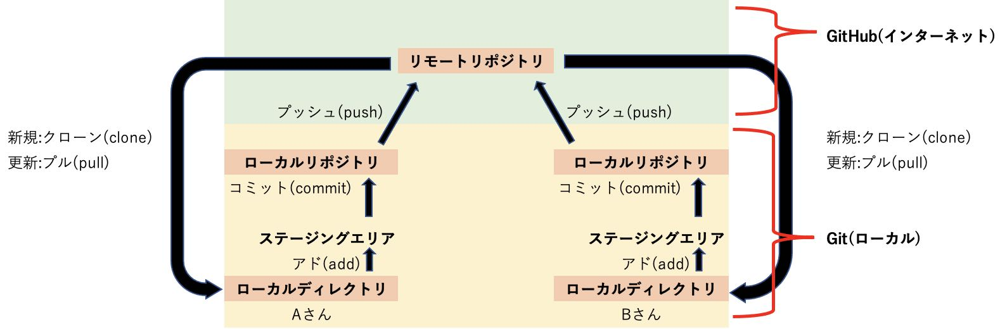

# Git、GitHubの用語解説

GitHub Classroomを利用するにあたり、GitやGitHubに関する用語を解説します。
なお、本来のバージョン管理ツールであるGit、GitHubの使い方については、夏のセミナーにて解説します。

以下は解説する用語がどのように関連しているかを示す図です。
解説を見ながら、どのように関連しているかをイメージしてください。

{: style="width: 660px;height: auto;" }

## リポジトリ(Repository)

Gitで管理されるプロジェクトの全ての変更履歴やファイルを保存するデータベースのようなものです。

## ローカルリポジトリ(local repository)

プロジェクトを自分のローカル環境に複製したリポジトリのことです。
自分のPCやサーバーに保存されており、ローカルで変更を加え、コミットやプッシュを行うことができます。

## リモートリポジトリ（remote repository）

プロジェクトを共有するために、複数の開発者がアクセスできるリポジトリのことです。
一般的には、オンラインのGitリポジトリホスティングサービス(GitHub)に保存されています。
  
## ステージングエリア(staging area)

リポジトリにコミットする前に変更を一時的に準備する場所です。
ステージングエリアを使用することで、コミットする前に変更の内容を選択的に追加(ステージ)し、コミットすることができます。

## クローン(clone)

リモートリポジトリを自分のローカル環境に複製することを指すコマンドです。
リモートリポジトリの全ての履歴やファイルを自分のPCにコピーし、ローカルリポジトリを作成します。

## プル(pull)

リモートリポジトリから最新の変更を取得して自分のローカルリポジトリを更新する操作です。

## アド(アド)

Gitで変更をステージングエリアに追加するコマンドです。ステージングエリアに追加された変更は、次のコミットに含まれます。

## コミット(commit)

ステージングエリアにある変更をローカルリポジトリに記録するコマンドです。
コミットは、変更の履歴を残し、特定のスナップショットを作成します。

## プッシュ(push)

ローカルリポジトリの変更をリモートリポジトリに反映するコマンドです。
変更をリモートリポジトリに送信し、共有されたプロジェクトに変更を適用します。
