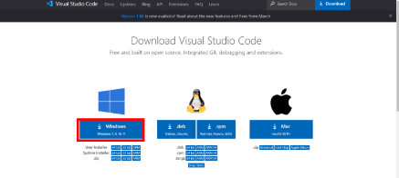
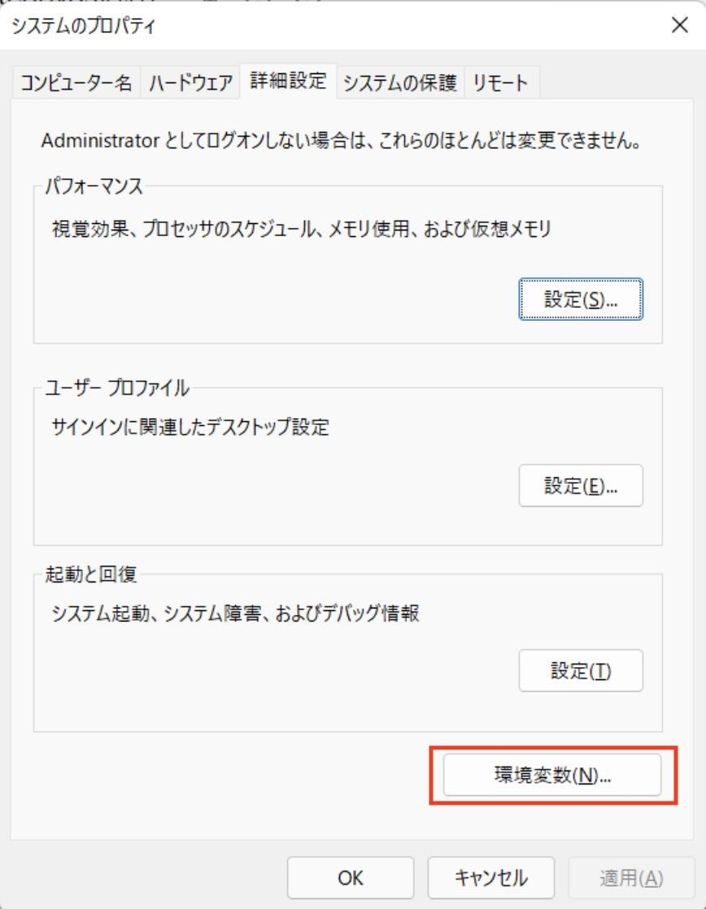
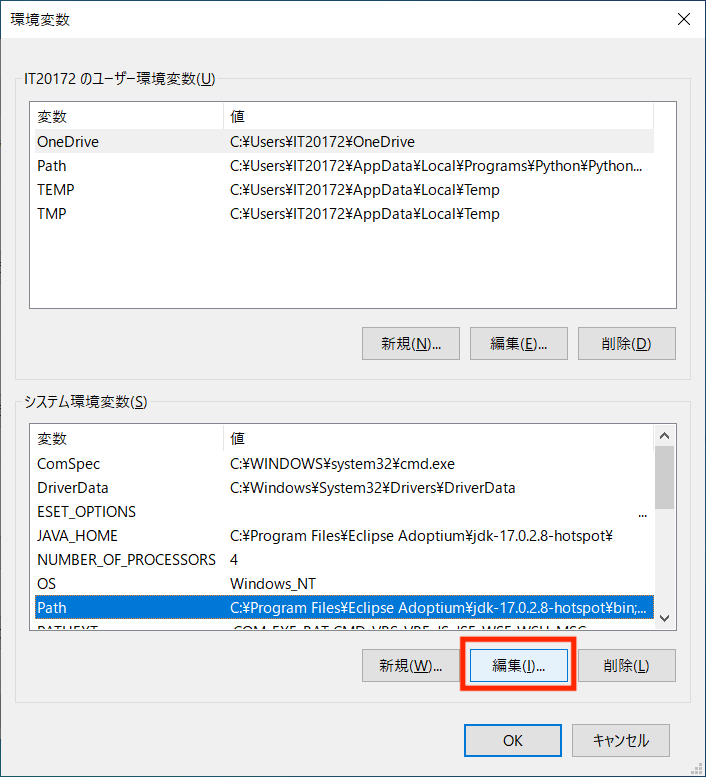
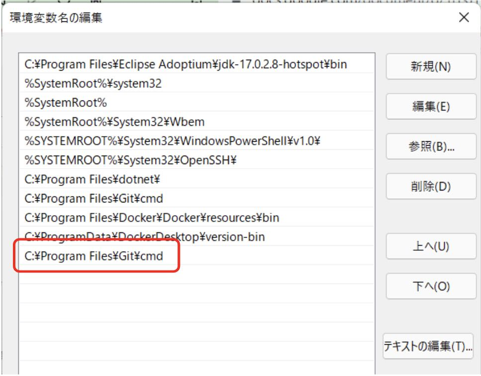

# 環境構築

## エディタ(Visual Studio Code)のインストール

VSCodeは拡張性の高いテキストエディタで、多数のプラグインが利用可能です。
プラグインの導入によりコーディング支援やバージョン管理が容易になり、効率的な開発が可能です。

1. インストールファイルのダウンロード<br>
Visual Studio Code(以下、「VSCode」と呼ぶ)のWebサイトにアクセスし、ダウンロードしてください。
2022年4月11日時点では、`VSCodeUserSetup-x64-1.66.1.exe`がダウンロードできます。
インストールサイトは[こちら。](https://code.visualstudio.com/Download)<br>
{: style="width: 360px;height: auto;object-fit: contain" }

1. インストーラの実行<br>
ダウンロードしたファイルをダブルクリックし、インストーラを起動してください。

1. セットアップ開始・インストール先の指定<br>
「同意する」を選択し、「次へ」をクリックし、デフォルトのまま「次へ」をクリックしてください。<br>


1. スタートメニューフォルダーの指定・追加タスクの選択<br>
デフォルトのまま「次へ」をクリックし、次の２つのみチェックを入れ、「次へ」をクリックしてください。<br>


1. インストール開始<br>
「インストール」をクリックすると、インストールが開始されます。<br>


1. VSCodeを起動<br>
「Visual Studio Codeを実行する」にチェックを入れ、「完了」をクリックします。
VSCodeが起動されればOKです。<br>


## Wingetのインストール(Macの方は不要)

WingetはWindows⽤パッケージ管理ツールです。
Wingetを使うことでアプリケーションの検索、インストール、アップデートが簡単にできます。<br>

既にインストールされている場合もあるので、先に確認しましょう。
PowerShellもしくはコマンドプロンプトから `winget -v` コマンドを実行してください。
バージョン(例：`v1.X.XXXXX`) が表示されれば既にインストールされています。<br>

Wingetを利⽤する場合、Microsoft Storeからインストールを⾏う必要があります。
Microsoft Storeで"Winget"と検索すると「アプリ インストーラ」※という名前のアプリが⾒つかります。
「アプリ インストーラ」のインストールを⾏ってください。<br>
※「アプリ インストーラ」が正式名称です。⼀般的にWingetと呼ばれていることが多いので、本資料でもWingetと呼びます。 <br><br>
正しくインストールされたか確認したいときは、PowerShellもしくはコマンドプロンプトから、再度 `winget -v` で確認し、バージョン(例：`v1.X.XXXXX`)が表示されればOKです。<br><br>

## Gitのインストール(Macはデフォルトでインストール済み)

バージョン管理ツールの一種です。
Gitの詳細については、別途セミナーで学びます。
ですので、今回は課題の提出方法として利用することに注力してください。<br>

PowerShellもしくはコマンドプロンプトから下記コマンドを実行する。<br>

```shell
winget install --id Git.Git
```

正しくインストールされたか確認したいときは、`git --version`でバージョン(例:`git version X.XX.X`)が表示されればOKです。<br>

```warning
### インストールしたけどgitコマンドが見つからない場合

`git --version`コマンドを実行した際、`‘git’ is not recognized as an internal or external command`とエラーになることがあります。環境変数がなぜか設定されていない可能性があるので、下記画像を参照に設定してください。

1. Windowsキー → `environ` と入力 → 「システム環境変数の編集」をクリック
{: style="max-width: 360px;max-height: 240px;object-fit: contain" }

2. 環境変数を押す<br>


3. 下部のシステム環境変数の`Path`の行を選択し、編集を押す。<br>


4. 新規をクリックし、`C:¥Program Files¥Git¥cmd`を追加する。赤枠内のように設定できればOK。<br>


5. PowerShellもしくはコマンドプロンプトを再起動し、`git --version`を実行し、バージョンが表示されればOK。
```

### GitHub

GitHub はGitリポジトリのホスティングサービスです。

インターネット上にリモートリポジトリを用意することで、離れた場所にいるメンバー同士で開発を行ったり、ソースコードを世界中に公開することができます。

### GitHubアカウント作成(※既にGitHubアカウントを作成済の方は不要)

1. GitHubのサイトにアクセスしてください。[GitHubのサイトはこちら](https://github.co.jp/)
2. 画面中央付近にある、緑色のGithub に登録するボタンをクリックしてください。
3. ここから先はUIが英語になります。ユーザー名、メールアドレス、パスワードを入力してください。
4. Verify your accountから指示に従ってアカウント認証を行ってください。
5. 認証が完了したらCreateaccountボタンをクリックします。
6. 登録したメールアドレス宛にEnter codeが送られてきますので、そちらを入力します。
7. アンケートに答えてください。(2回あります。)※アンケートが表示されない場合もあるので、その時はこの作業は無視してください。<br><br>
8. プランの選択画面になりますので、Free(左側)を 選択しましょう。プランはあとから変更できます。※プランの選択画面が表示されない場合もあるので、その時はこの作業は無視してください。<br>


1. 登録完了です。

<div style="page-break-before:always"></div>