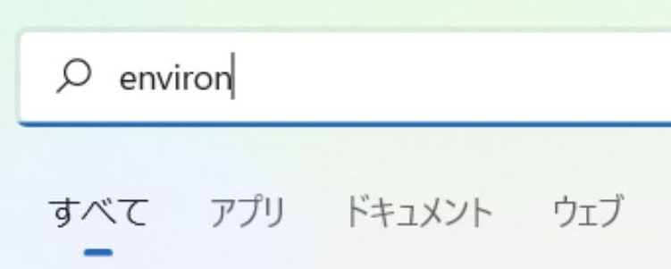
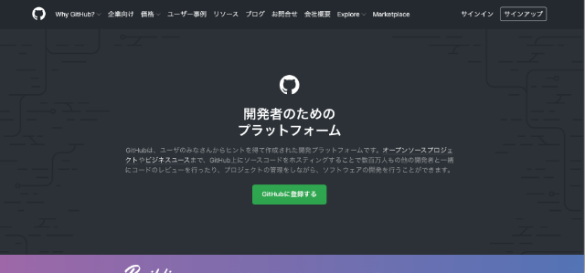
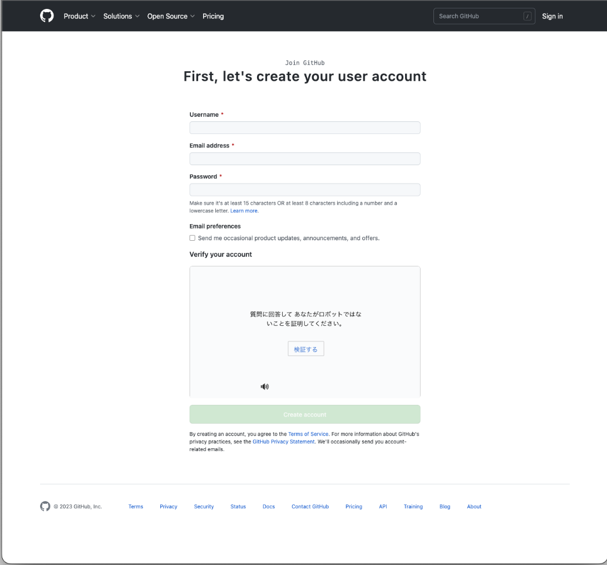
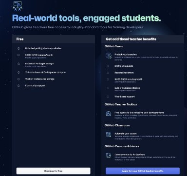

# 環境構築

## エディタ(Visual Studio Code)のインストール

VSCodeは拡張性の高いテキストエディタで、多数のプラグインが利用可能です。
プラグインの導入によりコーディング支援やバージョン管理が容易になり、効率的な開発が可能です。

1. インストールファイルのダウンロード<br>
Visual Studio Code(以下、「VSCode」と呼ぶ)のWebサイトにアクセスし、ダウンロードしてください。
2022年4月11日時点では、`VSCodeUserSetup-x64-1.66.1.exe`がダウンロードできます。
インストールサイトは[こちら。](https://code.visualstudio.com/Download)<br>
{: style="width: 510px;height: auto;" }

1. インストーラの実行<br>
ダウンロードしたファイルをダブルクリックし、インストーラを起動してください。

1. セットアップ開始・インストール先の指定<br>
「同意する」を選択し、「次へ」をクリックし、デフォルトのまま「次へ」をクリックしてください。<br>


1. スタートメニューフォルダーの指定・追加タスクの選択<br>
デフォルトのまま「次へ」をクリックし、次の２つのみチェックを入れ、「次へ」をクリックしてください。<br>


1. インストール開始<br>
「インストール」をクリックすると、インストールが開始されます。<br>


1. VSCodeを起動<br>
「Visual Studio Codeを実行する」にチェックを入れ、「完了」をクリックします。
VSCodeが起動されればOKです。<br>


出力に`user.name`と`user.email`の項目があるので、設定したとおりになっていればOKです。

## VSCodeの日本語化プラグインインストール

VSCodeを日本語化する **Japanese Language Pack for Visual Studio Code** というプラグインをインストールします。

1. VSCodeにて、Ctrl+Shift+Xと入力し、拡張機能の検索画面を表示
1. 検索欄に`japan`と入力
1. `Japanese Language Pack for Visual Studio Code`のInstallボタンをクリック
2. インストール後、再起動を求められるので再起動
3. VSCodeのメニューなどが日本語になっていればOK<br>
   ※VSCode自体の更新がかかると、度々日本語化が失われるときがあります。
   その場合は、このプラグインを再インストールするとOKです。

## Wingetのインストール(Macの方は不要)

WingetはWindows⽤パッケージ管理ツールです。
Wingetを使うことでアプリケーションの検索、インストール、アップデートが簡単にできます。<br>

既にインストールされている場合もあるので、先に確認しましょう。
PowerShellもしくはコマンドプロンプトから `winget -v` コマンドを実行してください。
バージョン(例：`v1.X.XXXXX`) が表示されれば既にインストールされています。<br>

Wingetを利⽤する場合、Microsoft Storeからインストールを⾏う必要があります。
Microsoft Storeで"Winget"と検索すると「アプリ インストーラ」※という名前のアプリが⾒つかります。
「アプリ インストーラ」のインストールを⾏ってください。<br>
※「アプリ インストーラ」が正式名称です。⼀般的にWingetと呼ばれていることが多いので、本資料でもWingetと呼びます。 <br><br>
正しくインストールされたか確認したいときは、PowerShellもしくはコマンドプロンプトから、再度 `winget -v` で確認し、バージョン(例：`v1.X.XXXXX`)が表示されればOKです。<br><br>

## Gitのインストール(Macはデフォルトでインストール済み)

バージョン管理ツールの一種です。
Gitの詳細については、別途セミナーで学びます。
ですので、今回は課題の提出方法として利用することに注力してください。<br>

PowerShellもしくはコマンドプロンプトから下記コマンドを実行する。<br>

```shell
winget install --id Git.Git
```

正しくインストールされたか確認したいときは、`git --version`でバージョン(例:`git version X.XX.X`)が表示されればOKです。<br>

```note
### インストールしたけどgitコマンドが見つからない場合

`git --version`コマンドを実行した際、`‘git’ is not recognized as an internal or external command`とエラーになることがあります。環境変数がなぜか設定されていない可能性があるので、下記画像を参照に設定してください。

1. Windowsキー → `environ` と入力 → 「システム環境変数の編集」をクリック
{: style="width: 510px;height: auto;" }

2. 環境変数をクリック

    {: style="width: 450px;height: auto;" }

3. 下部のシステム環境変数の`Path`の行を選択し、編集をクリック
{: style="width: 510px;height: auto;" }

4. 新規をクリックし、`C:¥Program Files¥Git¥cmd`を追加し、赤枠内のように設定できればOK
{: style="width: 510px;height: auto;" }

5. PowerShellもしくはコマンドプロンプトを再起動し、`git --version`を実行し、バージョンが表示されればOK
```

## Gitの初期設定

初めてGitを使う方は、名前とメールアドレスを登録しましょう。
PowerShellもしくはコマンドプロンプトから以下コマンドを実行してください。
**{}の入力はいりません。自分の名前、メールアドレスは半角英数字で！**

```shell
git config --global user.name {自分の名前}
git config --global user.email {メールアドレス}
```

確認には、以下コマンドを実行します。

```shell
git config --list
```

出力に`user.name`と`user.email`の項目があるので、設定したとおりになっていればOKです。

## Git用のVSCodeプラグインをインストール

VSCodeにGit操作をグラフィカルに表示する **Git Graph** プラグインをインストールします。

1. VSCodeにて、`Ctrl+Shift+X`と入力し、拡張機能の検索画面を表示
2. 検索欄に`Git Graph`と入力
3. `Git Graph`のInstallボタンをクリック
4. インストールが完了し、サイドバーにGit Graphのアイコンが追加されていればOK

## GitHubアカウント作成(※既にGitHubアカウントを作成済の方は不要)

GitHubはGitリポジトリのホスティングサービスです。
離れた場所のメンバーと開発を行ったり、ソースを世界中に公開したりできることから、多くの開発者に利用されています。
※以下の画像は昨年度のものですが、基本的な流れは変わりません。

1. GitHubのサイトにアクセス[GitHubのサイトはこちら](https://github.co.jp/)<br>
   {: style="width: 660px;height: auto;" }
2. 画面中央付近にある、緑色のGithub に登録するボタンをクリック
3. ここから先はUIが英語になります。ユーザー名、メールアドレス、パスワードを入力
4. Verify your accountから指示に従ってアカウント認証を行う<br>
   {: style="width: 660px;height: auto;" }
5. 認証が完了したらCreateaccountボタンをクリック
6. 登録したメールアドレス宛にEnter codeが送られてきますので、そちらを入力
7. アンケートに回答(※アンケートが表示されない場合もあるので、その時はこの作業は無視)<br>
   {: style="width: 660px;height: auto;" }
8. プランの選択画面になりますので、Free(左側)を選択(※プランの選択画面が表示されない場合もあるので、その時はこの作業は無視)<br>
    {: style="width: 660px;height: auto;" }
9. 登録完了
