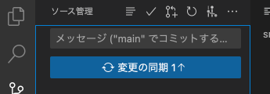

# 課題について

## 課題①

### ファイルの追加(add)とコミット(commit)

1. 課題として提出するファイルをVSCodeで開く 
   VSCodeのメニューから「ファイル->フォルダーを開く」を選択し、`C:¥web_app_dev¥02_htmlcss-...`を選択します。
2. VSCodeサイドバーのGit Graphのアイコン{: style="width: 20px;height: auto;" }をクリックします。
3. 変更の欄に`helloWorld.html`と`sample.html`が表示されていることを確認し、+ボタンをクリック 
    {: style="width: 660px;height: auto;" }
4. `helloWorld.html`と`sample.html`が「ステージされている変更」に移動していれば、addはOK 
{: style="width: 660px;height: auto;" }
5. メッセージの欄にメッセージを入力し、✔のボタンを押すとcommitもOK

### ファイルのプッシュ(push)

1. 変更の同期ボタンをクリック 
   {: style="width: 660px;height: auto;" } 
    ※「変更の同期」ボタンですが、同じローカルリポジトリを繰り返しpushすると、「Branchの発行」という文言に変わることがあります。
    どちらもリモートリポジトリにpushできるので問題はありません。

2. 再度[本章のリンク]()にアクセスし、pushした内容が反映されてればOK 
    {:       style="width: 660px;height: auto;" }

### 課題①の提出期限

提出期限は、**2025年X月XX日(X)**までとします。

## 課題②

オンライン学習プラットフォームProgate[]で、HTML&CSSの学習を進めてください。
