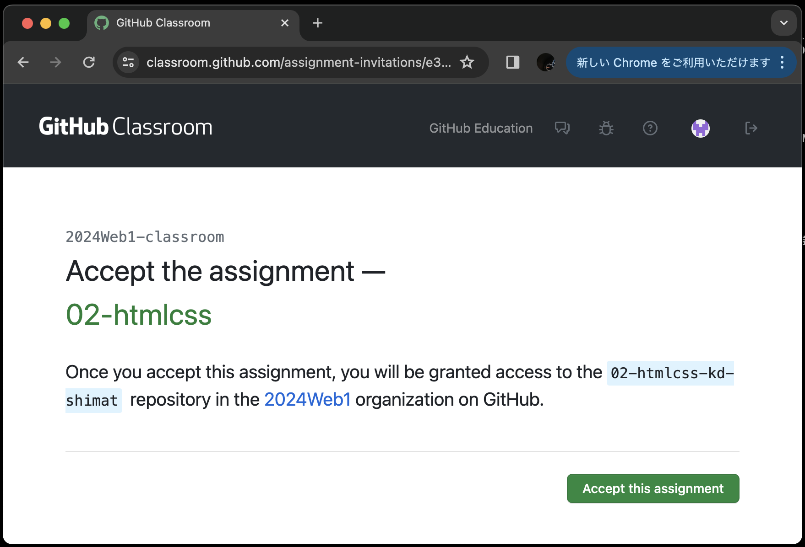
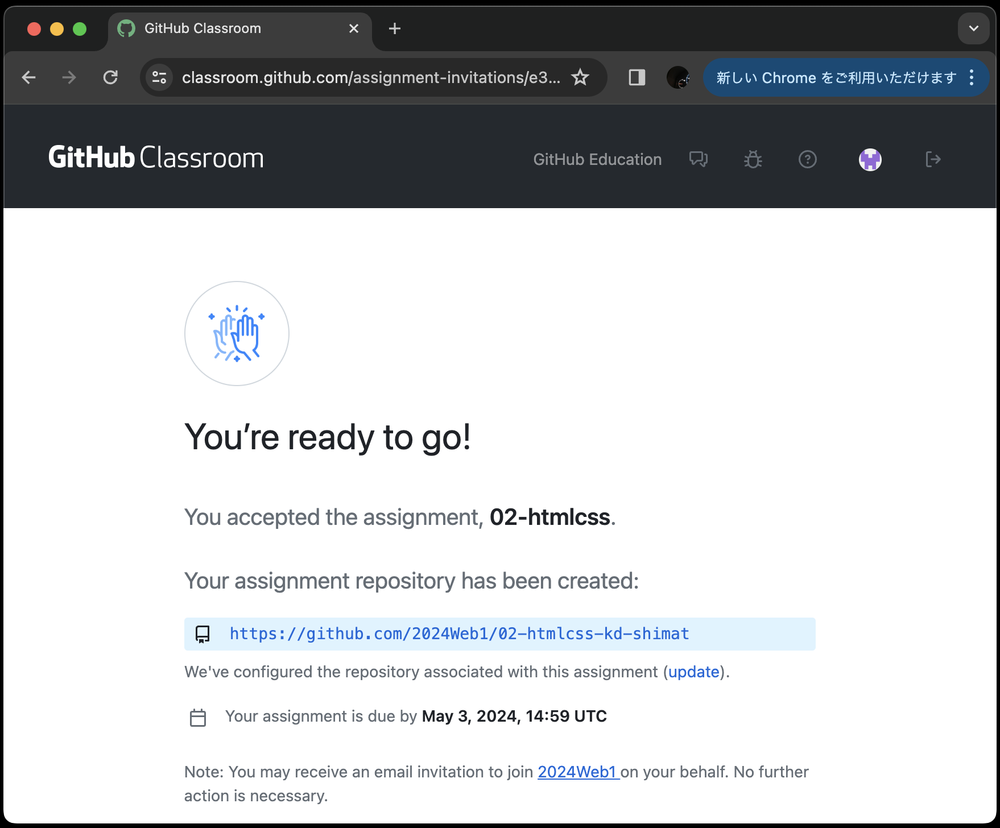

# GitHub Classroomからclone用URLを取得

```warning
前の章で以下の3つの環境構築ができていない人は[こちらのリンク]()から前の章にアクセスし、環境構築をしてください。

- VSCodeのインストール
- Gitのインストール
- GitHubアカウントの作成
```

1. [こちらのリンク]()からコードをclone
   ※認証を求められた場合は、GitHubアカウントでログインしてください。
2. 以下の画面で「Accept the assignment」をクリック
    {: style="width: 660px;height: auto;" }
3. リポジトリリンク(水色背景行)をクリックし、課題用に作成されたリポジトリにアクセス
   ※この画面にならない場合は、ブラウザをリロードしてください。<br>
    {: style="width: 660px;height: auto;" }
4. 緑のボタン(<>Code)をクリックし、HTTPSタブをクリック後、コピー用ボタンでclone用のURLをコピー

## VSCode(Visual Studio Code)でコードをclone

1. `Ctrl+Shift+P`を押し、フォームに`git: clone`と入力し、`Git:クローン`をクリック
2. フォームにclone用URLを貼り付けEnter<br>
    {: style="width: 660px;height: auto;" }
3. フォルダの選択画面になるので、`C:¥web_app_dev` フォルダを選択<br>
   ※認証を求められた場合は、ブラウザでアカウントを入れて認証してください。)
4. `C:¥web_app_dev` 直下にコード`02_htmlcss...`がcloneできていればOK
