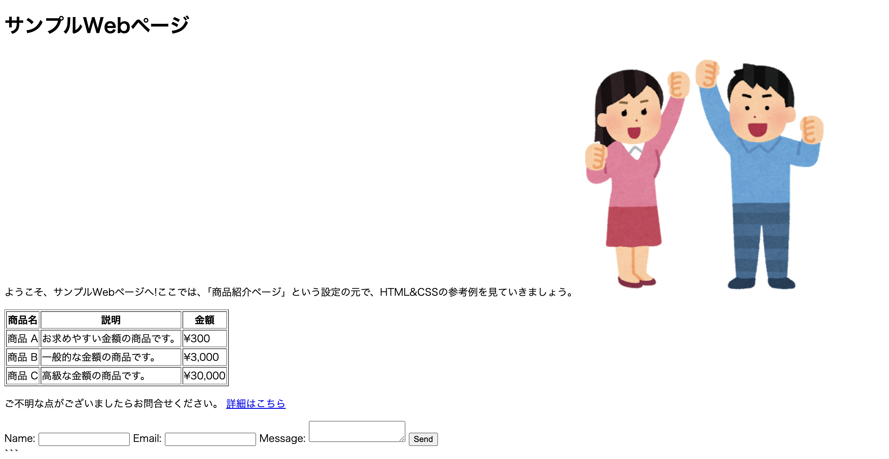
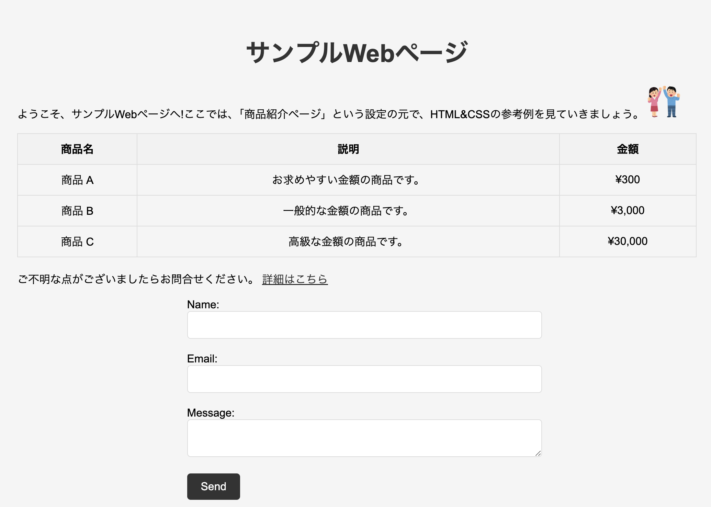

# CSS(Cascading Style Sheets)

先ほどお見せした以下の画面ですが、お世辞にも綺麗な画面とは言えませんね...

{: style="width: 660px;height: auto;" }

この問題を解決するために、先ほどのHTMLにCSSを反映させましょう。

## CSSとは

Webページの見た目を指定する言語です。
CSSは、HTMLで定義された構造にスタイルを適用することで、Webページを美しく、見やすくデザインすることができます。

今回は、あらかじめ以下のような`sample.css`を用意しています。

`sample.css`

```css
body {
  font-family: Arial, sans-serif;
  background-color: #f5f5f5;
  padding: 20px;
}

h1 {
  text-align: center;
  font-size: 36px;
  color: #333;
  margin-bottom: 20px;
}

table {
  width: 100%;
  border-collapse: collapse;
  margin-bottom: 20px;
}

th, td {
  border: 1px solid #ddd;
  padding: 10px;
  text-align: center;
}

th {
  background-color: #f2f2f2;
}

a {
  color: #333;
}

form {
  width: 50%;
  margin: 0 auto;
}

input[type="text"], textarea {
  width: 100%;
  padding: 10px;
  margin-bottom: 20px;
  border: 1px solid #ddd;
  border-radius: 5px;
  font-size: 16px;
}

input[type="submit"] {
  background-color: #333;
  color: #fff;
  padding: 10px 20px;
  border: none;
  border-radius: 5px;
  font-size: 16px;
  cursor: pointer;
}

input[type="submit"]:hover {
  background-color: #555;
}

img {
  max-width: 5%;
  height: auto;
}
```

よく見ると、`body`や`table`などHTMLのタグ名が書かれています。
これは、`body`や`table`などのタグに対して、CSSで指定されたスタイルを適用することができるということです。
例えば以下の場合は、`body`タグに対して、

- フォントをArialに指定
- 背景色を`#f5f5f5`に指定
- 余白を20pxに指定

というスタイルが適用されます。
なお、他のスタイルや詳細なCSSの書き方については、[MDN Web Docs](https://developer.mozilla.org/ja/docs/Web/CSS)などを参考にしてください。

```css
body {
  font-family: Arial, sans-serif;
  background-color: #f5f5f5;
  padding: 20px;
}
```

## HTMLにCSSを反映させる

先ほどのHTMLにCSSを反映させましょう。
`sample.html`に、`sample.css`を反映するための一文を追加します。

```html
<!DOCTYPE html>
<html lang="ja">
  <head>
    <meta charset="UTF-8">
    <!-- 以下の一文を追加することで、sample.cssを反映させることができます -->
    <link rel="stylesheet" href="sample.css">
    <!-- ここまで -->
    <title>サンプルWebページ</title>
  </head>
  <body>
    <h1>サンプルWebページ</h1>
    
    <p>
      ようこそ、サンプルWebページへ!ここでは、「商品紹介ページ」という設定の元で、HTML&CSSの参考例を見ていきましょう。
      
    </p>
  
    <table border="1">
      <tr>
        <th>商品名</th>
        <th>説明</th>
        <th>金額</th>
      </tr>
      <tr>
        <td>商品 A</td>
        <td>お求めやすい金額の商品です。</td>
        <td>¥300</td>
      </tr>
      <tr>
        <td>商品 B</td>
        <td>一般的な金額の商品です。</td>
        <td>¥3,000</td>
      </tr>
      <tr>
        <td>商品 C</td>
        <td>高級な金額の商品です。</td>
        <td>¥30,000</td>
      </tr>
    </table>
    
    <p>ご不明な点がございましたらお問合せください。 
      <a href="https://www.kobedenshi.ac.jp/">詳細はこちら</a>
    </p>
    
    <form>
      <label for="name">Name:</label>
      <input type="text" id="name" name="name" required>
      <label for="email">Email:</label>
      <input type="text" id="email" name="email" required>
      <label for="message">Message:</label>
      <textarea id="message" name="message" required></textarea>
      <input type="submit" value="Send">
    </form>
  </body>
</html>
```

では、もう一度ブラウザで`sample.html`を開いてみてください。
CSSで指定したスタイルが反映され、画面が綺麗になりました。<br>
{: style="width: 660px;height: auto;" }


