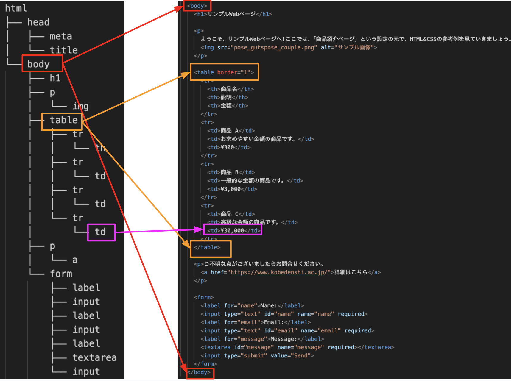

# HTMLの階層構造(DOM)

最後に、HTMLの概念的な構造について説明します。
タグの種類を完璧に覚えるより、**この概念を理解することが非常に大切**です。

HTMLは、階層構造を持ちます。
階層構造とは、HTML要素が親要素と子要素の関係で組織化されていることを意味します。

HTMLの階層構造は、ツリーのような構造を持ちます。
最上位の要素がルート要素（root element）であり、その下に複数の子要素があり、それらの子要素にさらに子要素を持つことができます。
このように、要素は親要素と子要素の関係で結ばれ、階層的に組織化されます。

階層構造は、HTML文書の構造を定義するために使用されます。
親要素は子要素を包み込み、子要素は親要素に含まれることになります。
これにより、Webページのレイアウトやデザインを制御することができます。

以下は、`sample.html`の階層構造とHTMLの関係を比較したものです。
HTMLは階層構造をタグの入れ子構造で表現します。

{: style="width: 660px;height: auto;" }

```warning
例年、階層構造に準じておらず、思うような挙動にならないケースが散見されますので、制作の際は注意しておきましょう。
```

## 本授業のHTMLとCSSの取り扱いについて

本授業は、PHPが主であり、コマ数が限られていることから、授業内でHTMLとCSSについて解説するのは今回のみです。
HTMLとCSSについては、プロゲート
HTMLについては、部分的に書くことがあります。
CSSについては基本的にこちらで用意します。

## まとめ

HTMLとCSSは、Webブラウザ上でテキストを美しく表示するために使われる言語です。
HTMLはレイアウト、CSSはデザインの役割を持つと覚えましょう。

厳密にはHTMLやCSSはプログラミング言語ではなく、**テキストを構造化するだけのマークアップ言語**です。
つまり、HTMLやCSSだけでは、制御構造を持つWebアプリケーションを構築することはできません。

そこでサーバーサイド言語である**PHP**の出番です。
本科目でPHPを学びながら、Webアプリケーションを構築する基本的な力を身につけていきましょう。
