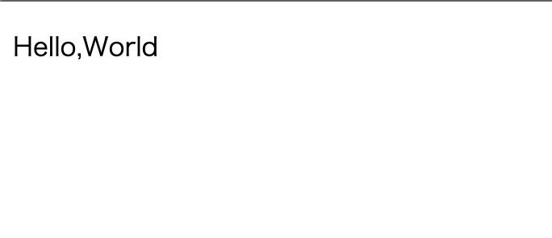

# HTML(HyperText Markup Language)

## HTMLとは

Webページを作るために使われるマークアップ言語の一つです。
マークアップ言語とは、文章やデータなどのテキスト情報に対して、意味や構造を付与するための言語です。
Webページには、テキスト、画像、動画、音声など様々なコンテンツが含まれます。
HTMLはこれらのコンテンツをどのように表示するかを指定するために使われます。

具体的には、HTMLでは各コンテンツに対して「タグ(<>)」と呼ばれる特定の記号を使って囲みます。
タグによって要素の意味や構造を示します。
例えば、`<p>`というタグは段落を表し、``というタグは画像を表します。

## HTMLを書いてみよう

cloneした`02_htmlcss-...`は以下の構造をしています。
※ちなみにcloneした  `02_htmlcss-...`の`...`には、Githubアカウントのユーザー名が入ります。

```text
02_htmlcss-...
├── helloWorld.html
├── sample.css
└── sample.html
```

`helloWorld.html`を開き、以下のコードを入力してください。<br>

`helloWorld.html`
```html
<!DOCTYPE html>
<html lang="ja">
    <head>
        <meta charset="UTF-8">
        <title>Hello,World</title>
    </head>
    <body>
        <p>Hello,World</p>
    </body>
</html>
```

入力後、ブラウザで`helloWorld.html`を開いてください。
エクスプローラ上で、ファイルを右クリック→「プログラムから開く」をクリック→所定のブラウザクリックすると開けます。

以下のように表示されればOKです。
{: style="width: 660px;height: auto;" }

## 具体的なHTMLのサンプルを見てみよう

ここからは、より複雑なHTMLとサンプルを紹介します。
以下はHTMLのサンプルコードです。
cloneしたソースコードの中にこれらは記入済みです。
VSCodeで`sample.html`を開いてください。

`sample.html`

```html
<!DOCTYPE html>
<html lang="ja">
  <head>
    <meta charset="UTF-8">
    <title>サンプルWebページ</title>
  </head>
  <body>
    <h1>サンプルWebページ</h1>
    
    <p>
      ようこそ、サンプルWebページへ!ここでは、「商品紹介ページ」という設定の元で、HTML&CSSの参考例を見ていきましょう。
      
    </p>
  
    <table border="1">
      <tr>
        <th>商品名</th>
        <th>説明</th>
        <th>金額</th>
      </tr>
      <tr>
        <td>商品 A</td>
        <td>お求めやすい金額の商品です。</td>
        <td>¥300</td>
      </tr>
      <tr>
        <td>商品 B</td>
        <td>一般的な金額の商品です。</td>
        <td>¥3,000</td>
      </tr>
      <tr>
        <td>商品 C</td>
        <td>高級な金額の商品です。</td>
        <td>¥30,000</td>
      </tr>
    </table>
    
    <p>ご不明な点がございましたらお問合せください。 
      <a href="https://www.kobedenshi.ac.jp/">詳細はこちら</a>
    </p>
    
    <form>
      <label for="name">Name:</label>
      <input type="text" id="name" name="name" required>
      <label for="email">Email:</label>
      <input type="text" id="email" name="email" required>
      <label for="message">Message:</label>
      <textarea id="message" name="message" required></textarea>
      <input type="submit" value="Send">
    </form>
  </body>
</html>
```

`sample.html`をブラウザで開いてみてください。
以下のように表示されればOKです。
タグを使用することにより、様々なコンテンツ(画像、表、入力フォームなど)がブラウザ上に表示されます。

{: style="width: 660px;height: auto;" }

```tip
### (付録)タグリファレンス

HTMLサンプルで使用したタグのリファレンスです。
タグは基本的に覚える必要はありませんが、どのようなタグがあるかを知っておくと、HTML文書の構造を理解しやすくなります。

<!DOCTYPE html>：HTML文書のバージョンとタイプを指定する宣言です。この宣言がない場合、ブラウザはHTML5として解釈されます。

`&lt;head>`：HTML文書のヘッダーを定義するためのタグです。このタグ内には、文書のタイトル、スタイルシート、JavaScriptファイル、キーワード、説明などのメタデータが含まれます。

&lt;meta>：HTML文書に関する情報を提供するためのタグです。charset属性を使用して、文書の文字エンコーディングを定義することができます。

`<title>`：HTML文書のタイトルを定義するためのタグです。このタグ内に書かれたテキストは、ブラウザのタブや検索エンジンの検索結果などで表示されます。

`<body>`：HTML文書の本文部分を定義するタグです。通常、ページのほとんどのコンテンツを含むブロック要素として使用されます。

`<h>`：タグはHTMLにおける見出しを定義するためのタグで、1から6までの数字で表される見出しレベルを持ちます。ドキュメントのセクションや節の見出しをマークアップするために使用されます。

`<p>`：タグはHTMLにおける段落を定義するタグです。文章やテキストを段落に分けるために使用されます。

``：画像を表示するためのHTML要素です。src属性に画像ファイルのURLを指定することで、画像を表示できます。

`<table>`：表を作成するために使用されるHTML要素です。通常、`<tr>`タグで定義された行と、`<th>`または`<td>`タグで定義された列から構成されます。

`<th>`：表の見出しを表すHTML要素です。このタグで囲まれたテキストは通常太字で表示されます。

`<td>`：表のセルを定義するHTML要素です。このタグで囲まれたテキストは通常標準のフォントで表示されます。

`<a>`：アンカータグとして知られ、他のページやWebサイトへのリンクを作成するために使用されます。href属性にリンク先のURLを指定することで、ユーザーがクリックすると指定されたページに移動します。

`<label>`:HTMLのフォーム要素に関連付けられたラベルを定義するためのタグです。for属性を使用して、ラベルと対象のフォーム要素を関連付けます。

`<form>`：ユーザーからの入力を受け付けるためのHTML要素です。このタグと以下の<`input`>,<`textarea`>に関しては、重要なタグであるため詳しく別の章で説明します。

`<input>`:HTMLのフォーム要素で、ユーザーにテキスト入力やボタンの選択などのインタラクティブな操作を可能にするためのタグです。

`<textarea>`:HTMLのフォーム要素で、複数行のテキストの入力を可能にするためのタグです。
```
