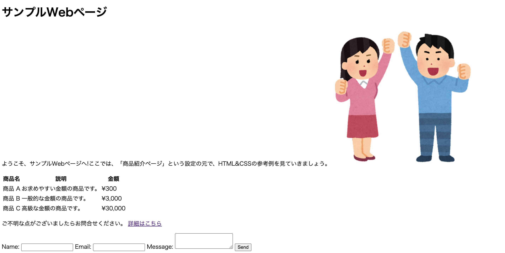
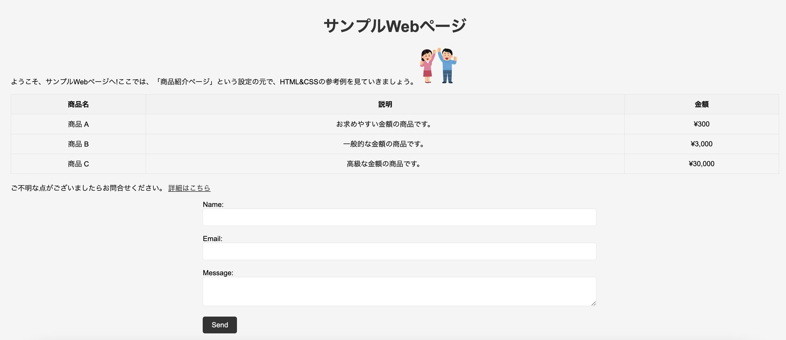

# HTMLとCSS


## HTMLを書いてみましょう

cloneした`02_htmlcss-...`は以下の構造をしています。※ちなみにcloneした  `02_htmlcss-...`の`...`には、Githubアカウントのユーザー名が入ります。

```text
02_htmlcss-...
├── helloWorld.html
├── sample.css
└── sample.html
```

`helloWorld.html`を開き、以下のコードを入力してください。
※`<!-- -->`で囲まれている部分はコメントです。書く必要はありません。

`helloWorld.html`
```html:helloWorld.html
<!DOCTYPE html>
<html lang="ja">
    <head>
        <meta charset="UTF-8">
        <title>Hello,World</title>
    </head>
    <body>
        <p>Hello,World</p>
        <p>0J0X0XX神戸電子</p>   <!--自分の出席番号と名前に書き換えてください-->
    </body>
</html>
```

入力後、ブラウザで`helloWorld.html`を開いてください。以下のように表示されればOKです。


## HTMLとCSSサンプルを見てみましょう

ここからは、より複雑なHTMLとCSSのサンプルを見ていきます。
以下はHTMLとCSSのサンプルコードです。
cloneしたソースコードの中にこれらは記入済みです。
VSCodeで`sample.html`と`sample.css`をそれぞれ開いてみてください。

`sample.html`
```html:sample.html
<!DOCTYPE html>
<html lang="ja">
  <head>
    <meta charset="UTF-8">
    <!-- コメントを外すと、CSSが有効になります。 -->
    <!-- <link rel="stylesheet" href="sample.css"> -->
    <title>サンプルWebページ</title>
  </head>
  <body>
    <h1>サンプルWebページ</h1>
    
    <p>
      ようこそ、サンプルWebページへ!ここでは、「商品紹介ページ」という設定の元で、HTML&CSSの参考例を見ていきましょう。
      
    </p>
  
    <table>
      <tr>
        <th>商品名</th>
        <th>説明</th>
        <th>金額</th>
      </tr>
      <tr>
        <td>商品 A</td>
        <td>お求めやすい金額の商品です。</td>
        <td>¥300</td>
      </tr>
      <tr>
        <td>商品 B</td>
        <td>一般的な金額の商品です。</td>
        <td>¥3,000</td>
      </tr>
      <tr>
        <td>商品 C</td>
        <td>高級な金額の商品です。</td>
        <td>¥30,000</td>
      </tr>
    </table>
    
    <p>ご不明な点がございましたらお問合せください。 
      <a href="https://www.kobedenshi.ac.jp/">詳細はこちら</a>
    </p>
    
    <form>
      <label for="name">Name:</label>
      <input type="text" id="name" name="name" required>
      <label for="email">Email:</label>
      <input type="text" id="email" name="email" required>
      <label for="message">Message:</label>
      <textarea id="message" name="message" required></textarea>
      <input type="submit" value="Send">
    </form>
  </body>
</html>
```

`sample.css`
```css:sample.css
body {
  font-family: Arial, sans-serif;
  background-color: #f5f5f5;
  padding: 20px;
}

h1 {
  text-align: center;
  font-size: 36px;
  color: #333;
  margin-bottom: 20px;
}

table {
  width: 100%;
  border-collapse: collapse;
  margin-bottom: 20px;
}

th, td {
  border: 1px solid #ddd;
  padding: 10px;
  text-align: center;
}

th {
  background-color: #f2f2f2;
}

a {
  color: #333;
}

form {
  width: 50%;
  margin: 0 auto;
}

input[type="text"], textarea {
  width: 100%;
  padding: 10px;
  margin-bottom: 20px;
  border: 1px solid #ddd;
  border-radius: 5px;
  font-size: 16px;
}

input[type="submit"] {
  background-color: #333;
  color: #fff;
  padding: 10px 20px;
  border: none;
  border-radius: 5px;
  font-size: 16px;
  cursor: pointer;
}

input[type="submit"]:hover {
  background-color: #555;
}

img {
  max-width: 5%;
  height: auto;
}
```
## CSS(Cascading Style Sheets)

Webページの見た目を指定する言語です。CSSは、HTMLで定義された構造にスタイルを適用することで、Webページを美しく、読みやすくすることができます。

今度は、`sample.html`をブラウザで開いてみてください。<br>


お世辞にも綺麗な画面とは言えませんね...<br>
原因はHTMLに、CSSが反映されていないからです。
では、CSSを反映しましょう。
`sample.html`の以下の部分のコメントを外します。

```html:sample.html
<!-- <link rel="stylesheet" href="sample.css"> -->
```

コメントの外し方は、該当の行で`Ctrl + /`です。
コメントを外すと以下のようになります。

```html:sample.html
<link rel="stylesheet" href="sample.css">
```

では、もう一度ブラウザで`sample.html`を開いてみてください。CSSが動き、画面が綺麗になりました。<br>


## ここまでのまとめ

HTMLとCSSは、Webブラウザ上でテキストを美しく表示するために使われる言語です。HTMLはレイアウト、CSSはデザインの役割を持つと覚えましょう。

ただし、厳密にはHTMLやCSSはプログラミング言語ではなく、テキストを構造化するためのマークアップ言語であるため、HTMLやCSSだけでは、皆さんが普段利用しているような、制御構造を持つWebアプリケーションを構築することはできません。

そこでサーバーサイド言語である**PHP**の出番です。本科目でPHPを学びながら、Webアプリケーションを構築する基本的な力を身につけていきましょう。

※本科目は、PHPがメインのため、HTMLとCSSについてレクチャーするのは今回のみです。CSSについては基本的にこちらで用意します。HTMLについては、皆さんに書いてもらいますが、サンプルコードはあるのでご安心ください。

## HTMLの構造について

最後にHTMLの概念的な構造について説明します。タグの種類を完璧に覚えるより、この概念を理解することが非常に大切です。

HTMLは、階層構造を持ちます。階層構造とは、HTML要素が親要素と子要素の関係で組織化されていることを意味します。

HTMLの階層構造は、ツリーのような構造を持ちます。最上位の要素がルート要素（root element）であり、その下に複数の子要素があり、それらの子要素にさらに子要素を持つことができます。このように、要素は親要素と子要素の関係で結ばれ、階層的に組織化されます。

階層構造は、HTML文書の構造を定義するために使用されます。親要素は子要素を包み込み、子要素は親要素に含まれることになります。これにより、Webページのレイアウトやデザインを制御することができます。以下は、`sample.html`の階層構造を図示したものです。

```text
html
├── head
│   ├── meta
│   ├── title
└── body
    ├── h1
    ├── p
    │   ├── img
    ├── table
    │   ├── tr
    │   │   ├── th
    │   ├── tr
    │   │   ├── td
    │   ├── tr
    │   │   ├── td
    │   ├── tr
    │   │   ├── td
    ├── p
    │   ├── a
    ├── form
    │   ├── label
    │   ├── input
    │   ├── label
    │   ├── input
    │   ├── label
    │   ├── textarea
    │   ├── input
    └───
```

## (付録)タグリファレンス

`<!DOCTYPE html>`：HTML文書のバージョンとタイプを指定する宣言です。この宣言がない場合、ブラウザはHTML5として解釈されます。

`<head>`：HTML文書のヘッダーを定義するためのタグです。このタグ内には、文書のタイトル、スタイルシート、JavaScriptファイル、キーワード、説明などのメタデータが含まれます。

`<meta>`：HTML文書に関する情報を提供するためのタグです。charset属性を使用して、文書の文字エンコーディングを定義することができます。

`<title>`：HTML文書のタイトルを定義するためのタグです。このタグ内に書かれたテキストは、ブラウザのタブや検索エンジンの検索結果などで表示されます。

`<body>`：HTML文書の本文部分を定義するタグです。通常、ページのほとんどのコンテンツを含むブロック要素として使用されます。

`<h>`：タグはHTMLにおける見出しを定義するためのタグで、1から6までの数字で表される見出しレベルを持ちます。ドキュメントのセクションや節の見出しをマークアップするために使用されます。

`<p>`：タグはHTMLにおける段落を定義するタグです。文章やテキストを段落に分けるために使用されます。

``：画像を表示するためのHTML要素です。src属性に画像ファイルのURLを指定することで、画像を表示できます。

`<table>`：表を作成するために使用されるHTML要素です。通常、`<tr>`タグで定義された行と、`<th>`または`<td>`タグで定義された列から構成されます。

`<th>`：表の見出しを表すHTML要素です。このタグで囲まれたテキストは通常太字で表示されます。

`<td>`：表のセルを定義するHTML要素です。このタグで囲まれたテキストは通常標準のフォントで表示されます。

`<a>`：アンカータグとして知られ、他のページやWebサイトへのリンクを作成するために使用されます。href属性にリンク先のURLを指定することで、ユーザーがクリックすると指定されたページに移動します。

`<label>`:HTMLのフォーム要素に関連付けられたラベルを定義するためのタグです。for属性を使用して、ラベルと対象のフォーム要素を関連付けます。

`<form>`：ユーザーからの入力を受け付けるためのHTML要素です。このタグと以下の<`input`>,<`textarea`>に関しては、重要なタグであるため詳しく別の章で説明します。

`<input>`:HTMLのフォーム要素で、ユーザーにテキスト入力やボタンの選択などのインタラクティブな操作を可能にするためのタグです。

`<textarea>`:HTMLのフォーム要素で、複数行のテキストの入力を可能にするためのタグです。

## 課題の提出

### テキストファイルの追加(add)とコミット(commit)

1. 課題として提出するファイルをVSCodeで開きます。VSCodeのメニューから「ファイル->フォルダーを開く」を選択し、<br>`C:¥web_app_dev¥02_htmlcss-...`を選択します。
1. VSCodeサイドバーのGit Graphのアイコンを押します。
2. 変更の欄に`helloWorld.html`と`sample.html`が表示されていることを確認し、+ボタンを押します。<br>

3. `helloWorld.html`と`sample.html`が「ステージされている変更」に移動していれば、addは成功です。<br>

4. メッセージの欄にメッセージを入力し、✔のボタンを押すとコミットは完了です。<br><br>

### テキストファイルをプッシュ(push)する

あとは課題を提出するのみです。

1. 変更の同期ボタンを押します。<br><br>
※ちなみにこの「変更の同期」ですが、同じローカルリポジトリを繰り返しpushすると、「Branchの発行」という文言に変わることがありますが、どちらもリモートリポジトリにpushできるので問題はありません。

1. ブラウザで、再度課題のリンクにアクセスすると(cloneで使ったURLでも良い)、編集内容が反映されていることがわかります。<br>

