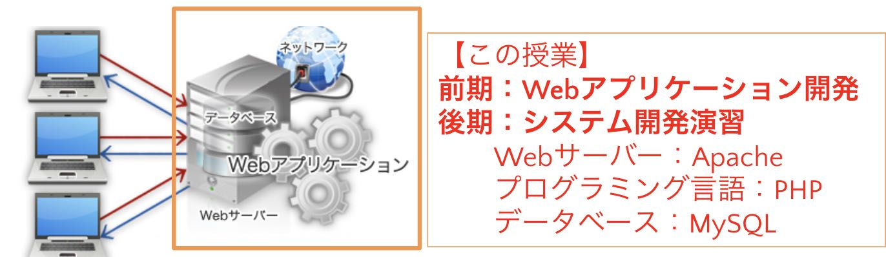
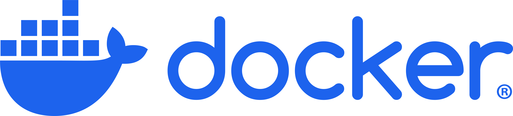

# バックエンドプログラム

- サーバー側で動作するプログラム
- クライアントから送られてきたデータを処理し、処理結果をクライアントに返信する
{: style="width: 600px;height: auto;" }

## PHP

- 1995年に誕生したオープンソースの汎用プログラミング言語
- コンパイル不要のスクリプト言語
- サーバー側で動的なウェブページを作成
- PHPの由来である“PHP:Hypertext Preprocessor”には、「Webページを構成するHTML(Hypertext)」を「事前に作り出す」という意味がある 
{: style="width: 510px;height: auto;" }

## Apache

- 世界中でもっとも多く使われているWebサーバソフトウェア
- 大規模な商用サイトから自宅サーバまで幅広く利用されている
- 開発は、Apacheソフトウェア財団のApache Licenseの下でソースコードが公開および配布されている代表的なオープンソースソフトウェアの一つ 

## MySQL

- オープンソースのリレーショナルデータベース管理システム(RDBMS)
- 幅広いアプリケーションで利用され、豊富なドキュメントとコミュニティサポートあり
- SQLを使用※忘れている人は2年生のテキスト「スッキリわかるSQL入門」で簡単なselect,insert,update,delete文を要復習！ 

## Docker

- アプリケーションをコンテナとしてパッケージ化し、環境差異を気にせずにどこでも実行できるオープンソースのプラットフォーム
- 本授業ではDockerを使用して、PHP、Apache、MySQLを含む開発環境を構築
- 各サービスを個別のコンテナとして実行し、それらを連携させることで、開発環境を迅速にセットアップ 
