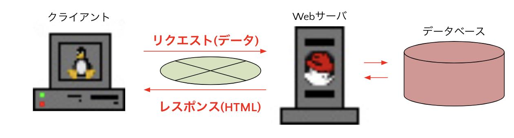
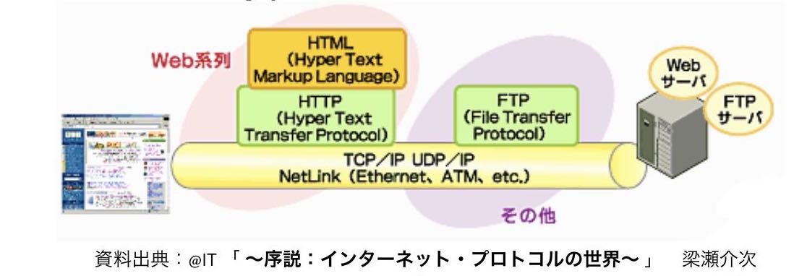
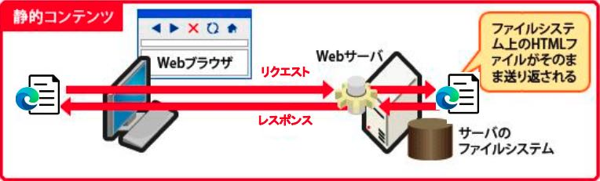
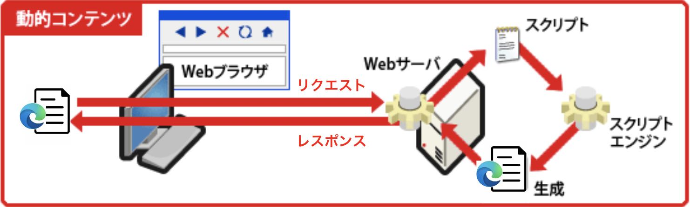

# Webアプリケーションについて

- クライアント側に特別なアプリは不要でWebブラウザのみあればよい
- クライアントからリクエストを送信
- サーバはリクエストを処理し、レスポンスを返す
{: style="width: 690px;height: auto;" }

## 基本技術

- Webアプリケーションは、次の技術がベースとなる
  - WWW（World  Wide  Web）
  - HTML（Hyper Text Markup Language）
  - TCP/IP（Transmission Control ProtocolとInternet Protocol）
  - HTTP（Hyper Text Transfer Protocol）
  {: style="width: 690px;height: auto;" }

## 進化の歴史

1. 最初はサーバーに保存されている静的コンテンツしかレスポンスできなかった

2. その後、リクエスト時にデータを送信し、それに応じて動的コンテンツをレスポンスできるようになった

## 動的コンテンツの例

動的コンテンツの例：Amazon(ログイン前)
.jpeg)
 
 
動的コンテンツの例：Amazon(ログイン後)
.jpeg)